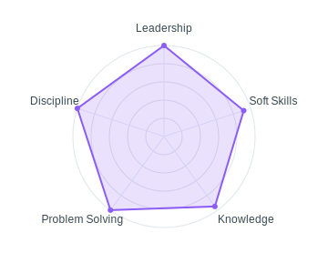

<h1 align="left">❄️Hi, I am Neeraj</h1>

  

  <em>B.Tech AI & DS at Chennai Institute of Technology - building machine learning models, scalable data pipelines, and full-stack applications. 1000+ solved problems across LeetCode, GFG, CodeChef and HackerRank. DA Grad'27.</em>

###

<table role="presentation" style="max-width:900px;width:100%;margin:0 auto;border-spacing:12px;">
<tr>
<td align="center" valign="middle" style="width:35%;padding:20px;background:rgba(255,255,255,0.05);border-radius:15px;border:2px solid rgba(139,92,246,0.3);box-shadow:0 4px 12px rgba(139,92,246,0.2);">

 

<table style="width:100%;border-collapse:separate;border-spacing:6px;">
<tr>
<td align="center" style="background:linear-gradient(135deg, #667eea 0%, #764ba2 100%);padding:12px;border-radius:10px;">

Total Commits

</td>
<td align="center" style="background:linear-gradient(135deg, #4facfe 0%, #00f2fe 100%);padding:12px;border-radius:10px;">

Stars Obtained

</td>
</tr>
<tr>
<td align="center" style="background:linear-gradient(135deg, #fa709a 0%, #fee140 100%);padding:12px;border-radius:10px;">

Public Repositories

</td>
<td align="center" style="background:linear-gradient(135deg, #f093fb 0%, #f5576c 100%);padding:12px;border-radius:10px;">

Contributions Last Year

</td>
</tr>
</table>

</td>
      <td align="center" valign="middle" style="width:65%;padding:20px;background:rgba(255,255,255,0.05);border-radius:15px;border:2px solid rgba(139,92,246,0.3);box-shadow:0 4px 12px rgba(139,92,246,0.2);">
        
        
Skill distribution

      </td>
    </tr>
  </table>

   
  <h2 align="center"> Top Projects</h2>
  
  

  <table style="width:100%;max-width:900px;margin:20px auto;border-collapse:separate;border-spacing:12px;">
    <tr>
      <td align="center" style="width:50%;padding:20px;background:rgba(255,255,255,0.05);border-radius:15px;border:2px solid rgba(139,92,246,0.3);box-shadow:0 4px 12px rgba(139,92,246,0.2);">
        <h3 style="background:linear-gradient(135deg, #667eea 0%, #764ba2 100%);color:white;padding:12px;border-radius:10px;text-align:center;margin:0 0 15px 0;">Machine Learning</h3>
        <ul style="list-style:none;padding:0;margin:0;text-align:center;">
          <li style="padding:8px 0;border-bottom:1px solid rgba(139,92,246,0.1);"><a href="https://github.com/Neerajdec2005/Estimation-of-Yearly-Internet-Usage-via-Stochastic-Gradient-Descent" style="color:inherit;text-decoration:none;">Estimation of Yearly Internet Usage via Stochastic Gradient Descent</a></li>
          <li style="padding:8px 0;border-bottom:1px solid rgba(139,92,246,0.1);"><a href="https://github.com/Neerajdec2005/breast-cancer-classifier-using-MLE-and-Batch-Gradient-Ascent" style="color:inherit;text-decoration:none;">Breast Cancer Classifier using MLE and Batch Gradient Ascent</a></li>
          <li style="padding:8px 0;border-bottom:1px solid rgba(139,92,246,0.1);"><a href="https://github.com/Neerajdec2005/Simple-AI-Assistant" style="color:inherit;text-decoration:none;">Simple AI Assistant</a></li>
          <li style="padding:8px 0;"><a href="https://github.com/Neerajdec2005/AKARI-Youtube-AI" style="color:inherit;text-decoration:none;">AKARI Youtube AI</a></li>
        </ul>
        

          
Tech Stacks:

          
          
          
          
          
        

      </td>
      <td align="center" style="width:50%;padding:20px;background:rgba(255,255,255,0.05);border-radius:15px;border:2px solid rgba(139,92,246,0.3);box-shadow:0 4px 12px rgba(139,92,246,0.2);">
        <h3 style="background:linear-gradient(135deg, #4facfe 0%, #00f2fe 100%);color:white;padding:12px;border-radius:10px;text-align:center;margin:0 0 15px 0;">Big Data</h3>
        <ul style="list-style:none;padding:0;margin:0;text-align:center;">
          <li style="padding:8px 0;border-bottom:1px solid rgba(139,92,246,0.1);"><a href="https://github.com/Neerajdec2005/Word-Count-using-Hadoop-MapReduce" style="color:inherit;text-decoration:none;">Word Count using Hadoop MapReduce</a></li>
          <li style="padding:8px 0;border-bottom:1px solid rgba(139,92,246,0.1);"><em style="color:#6B7280;">Upcoming</em></li>
          <li style="padding:8px 0;border-bottom:1px solid rgba(139,92,246,0.1);"><em style="color:#6B7280;">Upcoming</em></li>
          <li style="padding:8px 0;"><em style="color:#6B7280;">Upcoming</em></li>
        </ul>
        

          
Tech Stacks:

          
          
        

      </td>
    </tr>
    <tr>
      <td align="center" style="width:50%;padding:20px;background:rgba(255,255,255,0.05);border-radius:15px;border:2px solid rgba(139,92,246,0.3);box-shadow:0 4px 12px rgba(139,92,246,0.2);">
        <h3 style="background:linear-gradient(135deg, #fa709a 0%, #fee140 100%);color:white;padding:12px;border-radius:10px;text-align:center;margin:0 0 15px 0;">Full Stack Development</h3>
        <ul style="list-style:none;padding:0;margin:0;text-align:center;">
          <li style="padding:8px 0;border-bottom:1px solid rgba(139,92,246,0.1);"><a href="https://github.com/Neerajdec2005/GATE-ANALYSIS" style="color:inherit;text-decoration:none;">GATE ANALYSIS</a></li>
          <li style="padding:8px 0;border-bottom:1px solid rgba(139,92,246,0.1);"><a href="https://github.com/Neerajdec2005/Game-of-Life" style="color:inherit;text-decoration:none;">Game of Life</a></li>
          <li style="padding:8px 0;border-bottom:1px solid rgba(139,92,246,0.1);"><a href="https://github.com/Neerajdec2005/ELPL" style="color:inherit;text-decoration:none;">ELPL</a></li>
          <li style="padding:8px 0;"><a href="https://github.com/Neerajdec2005/Neeraj-s-Portfolio" style="color:inherit;text-decoration:none;">Neeraj's Portfolio</a></li>
        </ul>
        

          
Tech Stacks:

          
          
          
          
          
          
          
          
          
        

      </td>
      <td align="center" style="width:50%;padding:20px;background:rgba(255,255,255,0.05);border-radius:15px;border:2px solid rgba(139,92,246,0.3);box-shadow:0 4px 12px rgba(139,92,246,0.2);">
        <h3 style="background:linear-gradient(135deg, #f093fb 0%, #f5576c 100%);color:white;padding:12px;border-radius:10px;text-align:center;margin:0 0 15px 0;">OpenCV</h3>
        <ul style="list-style:none;padding:0;margin:0;text-align:center;">
          <li style="padding:8px 0;border-bottom:1px solid rgba(139,92,246,0.1);"><a href="https://github.com/Neerajdec2005/Real-Time-object-detection-and-presentation-using-point-clouds" style="color:inherit;text-decoration:none;">Real Time Object Detection and Presentation using Point Clouds</a></li>
          <li style="padding:8px 0;border-bottom:1px solid rgba(139,92,246,0.1);"><a href="https://github.com/Neerajdec2005/Word-Detection-Using-EasyOCR" style="color:inherit;text-decoration:none;">Word Detection Using EasyOCR</a></li>
          <li style="padding:8px 0;"><a href="https://github.com/Neerajdec2005/Mtcnn-Haar-Cascade-opencv-implemention" style="color:inherit;text-decoration:none;">Mtcnn Haar Cascade OpenCV Implementation</a></li>
        </ul>
        

          
Tech Stacks:

          
          
          
        

      </td>
    </tr>
    <tr>
      <td align="center" style="padding:20px;background:rgba(255,255,255,0.05);border-radius:15px;border:2px solid rgba(139,92,246,0.3);box-shadow:0 4px 12px rgba(139,92,246,0.2);text-align:center;">
        
Additional Tech Stacks:

        

          
          
          
          
          
          
          
        

      </td>
    </tr>
  </table>
  

   
  

    
    
  

   

  

    
  

###

<h2 align="center">Tech Portfolios</h2>

###

