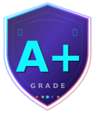
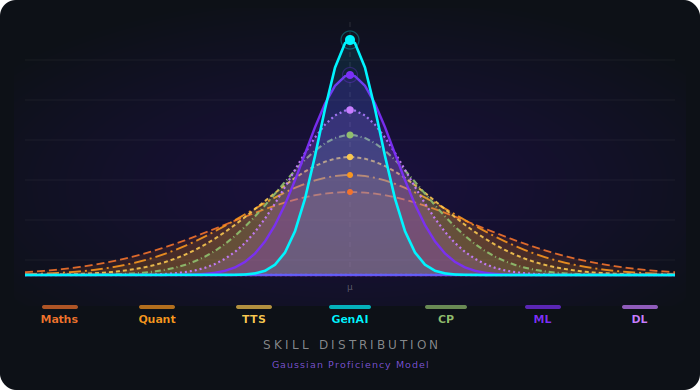

<h1 align="left">❄️Hi, I am Neeraj</h1>

  

  <em>B.Tech AI & DS at Chennai Institute of Technology - building machine learning models, scalable data pipelines, and full-stack applications. 1000+ solved problems across LeetCode, GFG, CodeChef and HackerRank. DA Grad'27.</em>

###

<table role="presentation" style="max-width:900px;width:100%;margin:0 auto;border-spacing:12px;">
<tr>
<td align="center" valign="middle" style="width:35%;padding:20px;background:rgba(255,255,255,0.05);border-radius:15px;border:2px solid rgba(139,92,246,0.3);box-shadow:0 4px 12px rgba(139,92,246,0.2);">

 

<table style="width:100%;border-collapse:separate;border-spacing:6px;">
<tr>
<td align="center" style="background:linear-gradient(135deg, #667eea 0%, #764ba2 100%);padding:12px;border-radius:10px;">

Total Commits

</td>
<td align="center" style="background:linear-gradient(135deg, #4facfe 0%, #00f2fe 100%);padding:12px;border-radius:10px;">

Stars Obtained

</td>
</tr>
<tr>
<td align="center" style="background:linear-gradient(135deg, #fa709a 0%, #fee140 100%);padding:12px;border-radius:10px;">

Public Repositories

</td>
<td align="center" style="background:linear-gradient(135deg, #f093fb 0%, #f5576c 100%);padding:12px;border-radius:10px;">

Contributions Last Year

</td>
</tr>
</table>

</td>
      <td align="center" valign="middle" style="width:65%;padding:20px;background:rgba(255,255,255,0.05);border-radius:15px;border:2px solid rgba(139,92,246,0.3);box-shadow:0 4px 12px rgba(139,92,246,0.2);">
        
        
Skill distribution

      </td>
    </tr>
  </table>

   
  <h2 align="center">Top Projects</h2>

<table>
<tr><th>Machine Learning</th><th>Agentic AI</th></tr>
<tr><td>

|Title | Stars | Views | Technologies|
|--|--|--|--|
| [Neural Network for Fashion MNIST](https://github.com/Neerajdec2005/Neural-Network-for-Fashion-MNIST) |  |  |  |
| [Neural Network Concepts](https://github.com/Neerajdec2005/Neural-Network-Concepts) |  |  |  |
| [Yearly Internet Usage via SGD](https://github.com/Neerajdec2005/Estimation-of-Yearly-Internet-Usage-via-Stochastic-Gradient-Descent) |  |  |   |
| [Breast Cancer Classifier MLE+BGA](https://github.com/Neerajdec2005/breast-cancer-classifier-using-MLE-and-Batch-Gradient-Ascent) |  |  |   |

</td><td>

|Title | Stars | Views | Technologies|
|--|--|--|--|
| [AKARI YouTube AI](https://github.com/Neerajdec2005/AKARI-Youtube-AI) |  |  |  |
| [Simple AI Assistant](https://github.com/Neerajdec2005/Simple-AI-Assistant) |  |  |  |
| [Law-Aware AI](https://github.com/Neerajdec2005/Law-Aware-AI) |  |  |   |

</td></tr> </table>

<table>
<tr><th>Generative AI</th><th>Big Data</th></tr>
<tr><td>

|Title | Stars | Views | Technologies|
|--|--|--|--|
| [Gemma-2B Fine-Tuned on 25K Python Codes](https://github.com/Neerajdec2005/Gemma-2B-Fine-Tuned-on-25K-Python-Codes) |  |  |   |
| [Diffusion TTS](https://github.com/Neerajdec2005/Diffusion-TTS) |  |  |   |

</td><td>

|Title | Stars | Views | Technologies|
|--|--|--|--|
| [Word Count via Hadoop MapReduce](https://github.com/Neerajdec2005/Word-Count-using-Hadoop-MapReduce) |  |  |   |

</td></tr> </table>

<table>
<tr><th>Full Stack Development</th><th>Computer Vision</th></tr>
<tr><td>

|Title | Stars | Views | Technologies|
|--|--|--|--|
| [GATE Analysis](https://github.com/Neerajdec2005/GATE-ANALYSIS) |  |  |   |
| [Game of Life](https://github.com/Neerajdec2005/Game-of-Life) |  |  |  |
| [ELPL](https://github.com/Neerajdec2005/ELPL) |  |  |  |
| [Neeraj's Portfolio](https://github.com/Neerajdec2005/Neeraj-s-Portfolio) |  |  |  |

</td><td>

|Title | Stars | Views | Technologies|
|--|--|--|--|
| [Real-Time Object Detection via Point Clouds](https://github.com/Neerajdec2005/Real-Time-object-detection-and-presentation-using-point-clouds) |  |  |   |
| [Word Detection via EasyOCR](https://github.com/Neerajdec2005/Word-Detection-Using-EasyOCR) |  |  |  |
| [MTCNN Haar Cascade OpenCV](https://github.com/Neerajdec2005/Mtcnn-Haar-Cascade-opencv-implemention) |  |  |   |

</td></tr> </table>

 

  
  

   

  

    

  

###

<h2 align="center">Tech Portfolios</h2>

###

  

